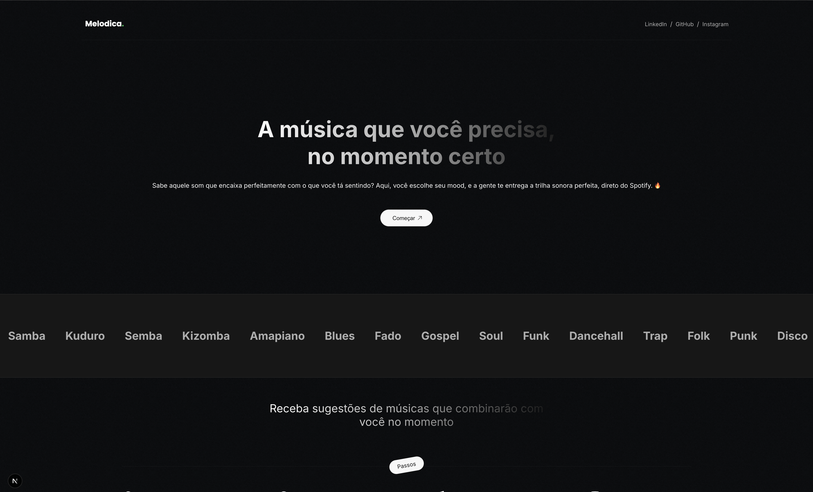

# Melodica

**Melodica** is a mood-based music recommendation app that helps you discover playlists based on how you feel

## Features

- Connect your Spotify account with OAuth
- Select your current mood (Happy, Sad, relaxed, focused, romantic, and angry)
- Get playlist recommendations tailored to your mood
- Open playlists directly in Spotify
- Save the ones you love to your Spotify library

## Built With

- [Next.js](https://nextjs.org/) – React framework for SSR and fast builds
- [Spotify Web API](https://developer.spotify.com/documentation/web-api/)
- [OAuth 2.0](https://developer.spotify.com/documentation/general/guides/authorization-guide/) – for Spotify login

## Getting Started

### Prerequisites

- Node.js (18+ recommended)
- A Spotify Developer account ([Create here](https://developer.spotify.com/dashboard/))

### Installation

```bash
# Clone the repo
git clone https://github.com/SavioTito/melodica.git
cd melodica

# Install dependencies
npm install
```

### Environment Variables

Create a `.env.local` file in the root directory and add:

```env
SPOTIFY_CLIENT_ID=your_spotify_client_id
SPOTIFY_CLIENT_SECRET=your_spotify_client_secret
SPOTIFY_REDIRECT_URI=http://localhost:3000/api/auth/callback
NEXT_PUBLIC_FRONTEND_URL=http://localhost:3000/

```

Make sure your **Spotify app settings** have the redirect URI set to match.

### Running the App

```bash
npm run dev
```

Open [http://localhost:3000](http://localhost:3000) to view the app.

## Screenshots



## Contributing

Pull requests are welcome! For major changes, please open an issue first to discuss what you’d like to change.

## License

[MIT](./LICENSE)
